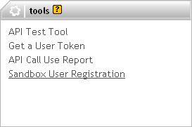
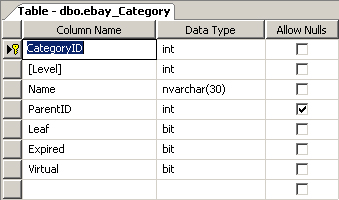

# eBay Developers Program (.NET SDK)

## Introduction

The [eBay Developers Program](http://developer.ebay.com/) provides you with a set of APIs that you can use to interact with the eBay servers. You can call these APIs using any major programming language (.NET, Java, PHP..etc.). For most programming languages an SDK is provided that you can use to call most of the APIs.

The following list is not exhaustive, but are some of the most important APIs offered by eBay:

- **Trading API**: List or buy items
- **Shopping API**: Search & Browse items
- **Clients Alerts API**: Ask eBay if your data has changed
- **Platform Notifications API**: eBay notifies you if your data has changed
- ...

This article explains how you can enable a simple stock management application to list its products on eBay. To achieve this you need to use the Trading API. When one of your products is sold on eBay, ideally, you want to be notified about it. To this end, you can configure the Platform Notifications API to inform you about events such as this.

The eBay API is rediciously huge and can be quite complex. This article focuses on the absolute minimum requirements needed to list an item on eBay. At the end of this article you'll be able to:

- List an article on eBay
- Revise an existing listing
- Remove a listing
- Receive a notification when one of your products is sold

Let's get started...

## Demo Application

The stock management application that I mentioned in the introduction is a simple ASP.NET MVC 1.0 website. It uses the [Northwind database](http://www.microsoft.com/downloads/details.aspx?FamilyID=06616212-0356-46A0-8DA2-EEBC53A68034&displaylang=en), so be sure to install it first.

This article is not a primer on building ASP.NET MVC websites so I will not delve deeper into this topic by explaining how the website was built. It's a simple MVC site that uses LINQ To Sql to retrieve and manipulate data and allows you to perform the following operations:

- Retrieve a list of products
- Add a product
- Revise a product
- Delete a product

Thus nothing more than basic CRUD functionality for the products table of the Northwind database. For more information about building such a MVC site check out the following articles:

- [CRUD Operation in ASP.NET MVC](http://www.c-sharpcorner.com/UploadFile/dhananjaycoder/AuthorContactManager06102009052732AM/AuthorContactManager.aspx)
- [CRUD operations ASP.NET MVC 1](http://www.techbubbles.com/aspnet/crud-operations-using-asp-net-mvc-1/)

**Figure 1** - Northwind Product Catalog


The source for this site is included in the [source code](#download) accompanying this article.

## Join The Developers Program

Before you can use the eBay API you need to [join the eBay Developers Program](https://developer.ebay.com/join/). Once you've created your account you need to generate a set of application keys. These application keys (GUIDS) tell eBay which developer and application is making a call. You can generate and retrieve your keys at any time from your Developer Account.

You can generate a set of keys for eBay's sandbox and production environment. Obviously we don't want to list products in the production environment so just create a set of keys for the sandbox environment.

The next thing you want to do, is to create a user account for [eBay's sandbox environment](http://www.sandbox.ebay.com/). You cannot use your developer account to login to the sandbox environment.

From you developer account you can create new sandbox users by selecting the option "[Sandbox User Registration](https://developer.ebay.com/DevZone/sandboxuser/)". Select this option and create a user account.

**Figure 2** - Sandbox User Registration



After you have created a sandbox user account, you need to generate a [user token](https://developer.ebay.com/DevZone/account/tokens/Default.aspx). A user token represents the consent that an eBay user (the sandbox user in this case) has given your application access to eBay data on his or her behalf. The Trading API for instance requires the presence of a user token.

When you generate a user token, you will be taken to the eBay sign-in page, where you need to log on using the credentials of the previously created sandbox user. This user will be associated with the token. You can compare this to an [access token](<http://msdn.microsoft.com/en-us/library/aa374909(VS.85).aspx>) in Windows.

You can generate a user token from your developer account by selecting the option "Get a User Token" (see Figure 2). Beware that a user token has an expiration date. Usually this something like a year and a half.

## Hello, World!

Time to build your first eBay enabled application. Before you start you need to download the [eBay SDK for .NET](http://developer.ebay.com/community/featured_projects/?name=eBay+SDK+for+.NET). At the time of writing there are two versions of the SDK. One that supports .NET 1.1 (Maintenance Version) and one for .NET 2.0, which is still in beta phase. The final release should be out somewhere this year. For now just download and install the .NET 2.0 version of the SDK.

Startup Visual Studio and create a new blank solution called eBay. Next add a Console Application project titled HelloWorld to the solution and add a new application configuration file (App.config) to this project.

The application settings section of the configuration file will contain your eBay application keys, user token, URL to the sandbox environment...etc. I'm not going to list all of the application settings here as it is a rather extensive list. Just download the source code to see which application settings you need to fill in. It won't take more than a minute of your time.

Add a reference to the eBay.Service and Samples.Helper assemblies. You'll find these assemblies in the directory into which you installed the eBay SDK for .NET. By default this is the directory C:\\Program Files\\eBay\\. Add the code shown in Listing 1 to the Main(...) method of the Program class.

**Listing 1** - eBay Current Date And Time (Official eBay Time)

```csharp
ApiContext context = AppSettingHelper.GetApiContext();

context.ApiLogManager = new ApiLogManager();
context.ApiLogManager.ApiLoggerList.Add(new FileLogger("log.txt", true, true, true));
context.ApiLogManager.EnableLogging = true;
context.Site = SiteCodeType.US;

GeteBayOfficialTimeCall apiCall = new GeteBayOfficialTimeCall(context);

DateTime officialTime = apiCall.GeteBayOfficialTime();

Console.WriteLine(String.Format("Official eBay Time: {0}", officialTime));
Console.WriteLine();
Console.WriteLine("Press any key to close this application...");
Console.ReadKey();
```

Let's quickly go over this code. First a context (ApiContext type) which defines the boundaries in which we can call the eBay API is setup. This context is populated with the data found in the application settings. These application settings are read by the AppSettingsHelper's method GetApiContext(). Both the ApiContext and AppSettingsHelper type are provided by the eBay SDK.

eBay provides XML- and SOAP based APIs, but we only use the SOAP version in this article. You can configure the context to log all of the communication to a logger of your choice. Here we're going to log all the SOAP messages to a text file.

You also need to specify which eBay site (context.Site) you want to target. Each [eBay site](http://developer.ebay.com/devzone/finding/CallRef/Enums/GlobalIdList.html) is identified by a different id. You can use the SiteCodeType enumeration to assign a value. In this example we're going to target the US eBay site.

The SDK wraps each API call in it's own type. Here we create a new instance of the GeteBayOfficialTimeCall() type and call it's GeteBayOfficialTime() method which returns a DateTime variable. When you run the project your output should resemble the following screenshot.

**Figure 3** - Official eBay Date & Time


## eBay Categories

If you want to list a product on eBay you need to include some required information that describes the product. One of these required fields is the eBay category in which you wish to place the product. You can specify up to two eBay categories for each listing. Each eBay site (US, Belgium, France, Germany...etc.) has its own set of categories.

Each category has a unique identifier (CategoryID) and can belong to a parent category. So it's essentially a tree structure. You need to download these categories and save them locally. When you list a product you need to send along the category id of one of the eBay categories.

**Remark**: eBay regularly updates its list of categories so you need to update your local list of eBay categories once in a while. The list of categories is versioned so you can check the current version prior to updating this list. More information about maintaining a list of eBay categories can be found [here](http://developer.ebay.com/DevZone/XML/docs/WebHelp/wwhelp/wwhimpl/js/html/wwhelp.htm?context=eBay_XML_API&topic=CategorySync).

To store the eBay categories locally I created a new table in the Northwind database:

**Figure 4** - ebay_Category table



You can download the eBay categories by using the GetCategoriesCall(...) API. Specify a detail level of ReturnAll (DetailLevelCodeType enumeration) to retrieve everything.

**Listing 2** - Downloading The eBay Categories

```csharp
GetCategoriesCall apiCall =
    new GetCategoriesCall(ApiContext)
    {
        EnableCompression = true,
        ViewAllNodes = true
    };
apiCall.DetailLevelList.Add(DetailLevelCodeType.ReturnAll);
apiCall.GetCategories();
```

You have to setup the ApiContext as shown in Listing 1. The GetCategoriesCall(...) API knows for which site to retrieve the categories based upon the context you pass into it. Once the categories are downloaded you need to parse the result in order to save the category tree as shown in Listing 3.

**Listing 3** - Saving The eBay Category Tree

```csharp
foreach (CategoryType category in apiCall.CategoryList)
{
    int categoryId = Int32.Parse(category.CategoryID);
    int? parentId = Int32.Parse(category.CategoryParentID[0]);
    if (parentId == categoryId) { parentId = null; }
    // ...etc.
    // Save category
}
```

Check out the eBaySynchronizer project for a full code sample on how to do this.

**Remark**: There are more than 21.000 categories for the US eBay site, more than 4000 for the Belgian (Dutch) one...etc. It is quite a big list, so this can take some time. This is the main reason why you want to store this list locally. For each category eBay tells you if it is a leaf category (bottom-most) or not. You can only list products in a leaf category!

## Listing Items

Finally you've arrived at the section of this text where you actually find out how to list an item on eBay. The web application included in the source code serializes a product and saves it to an XML file whenever a product needs to be listed, revised or deleted.

Another console application monitors the directory into which these XML files are saved and processes them. It is this application that actually lists your products on eBay. The web application does nothing more than serialize the products and save the output to a directory.

You don't have to reproduce this setup. This just was something I played with while writing the sample code for this article, feel free to do this any which way you want.

**Remark**: The code that monitors the directory into which the XML files are saved and processes them is discussed in a previous article of mine. [Feel free to check it out](https://github.com/geersch/FileSystemWatcher).

For this article we are going to list fixed price items, not live auctions as you might have expected. Although can you adjust the code easily to allow for this. To list an item on eBay you have to create a new instance of the [ItemType class](http://developer.ebay.com/DevZone/XML/docs/Reference/ebay/types/ItemType.html).

This ItemType instance contains the data that defines a listing. You need to populate this object with the defintion of a new item. You also use this type when revising listing or retrieving item data from eBay.

For most listings you need to provide the following information:

- **General information**: Title, description, price, currency, listing type (auction, fixed price...etc.), listing duration...etc.
- **Categories**: Primary, secondary eBay categories. If you have an eBay store you can also specify up to two of your custom store categories.
- **Payment Methods**
- **Shipping Details**
- **Payment Methods**

**Remark**: Depending on the eBay categories into which you place your listing additional requirements may be enforced. Some categories require at least one domestic shipping service, require a PayPal payment method, forbid reserve prices...etc. Check out the [GetCategories()](http://developer.ebay.com/DevZone/xml/docs/Reference/ebay/GetCategories.html), [GetCategoryFeatures()](http://developer.ebay.com/DevZone/xml/docs/Reference/ebay/GetCategoryFeatures.html) and [GetCategory2CS()](http://developer.ebay.com/DevZone/xml/docs/Reference/ebay/GetCategory2CS.html) APIs to find out which features a specific category supports. Forget about these requirements for this article, we'll concentrate on the bare minimum to create a new listing and this should work fine in most cases.

Let's take at the code needed to compose a new ItemType instance:

**Listing 4** - Creating A New ItemType Instance

```csharp
ItemType item = new ItemType();

// Description of the item
item.Title = product.ProductName;
item.Description = product.ProductName;

// Listing type and price
item.ListingType = ListingTypeCodeType.FixedPriceItem;
item.Currency = CurrencyUtility.GetDefaultCurrencyCodeType(_apiContext.Site);
item.StartPrice = new AmountType
{ currencyID = item.Currency, Value = Convert.ToDouble(product.UnitPrice) };

// Listing is valid for X days
item.ListingDuration = "Days_7";

// Where is the item located?
item.Location = "Fresno, California";
item.Country = SiteUtility.GetCountryCodeType(_apiContext.Site);

// List the item under the following leaf category
CategoryType category = new CategoryType
{ CategoryID = product.EBayCategoryId.ToString() };
item.PrimaryCategory = category;
//item.SecondaryCategory = ....;

// Available quantity
item.Quantity = product.Quantity;

// Supported payment methods
item.PaymentMethods = new BuyerPaymentMethodCodeTypeCollection();
item.PaymentMethods.AddRange(new[] { BuyerPaymentMethodCodeType.PayPal });
// Paypal e-mail address required if PayPal is listed as a payment method
item.PayPalEmailAddress = "me@paypal.com";

// Shipping details
item.DispatchTimeMax = 1;
item.ShippingDetails = GetShippingDetails();

// Return policy
item.ReturnPolicy = GetPolicyForUS();
```

It's quite straightforward to create a new ItemType instance. Let's recapitulate what's going on:

1. The item is described by setting its title and description.
2. The listing type (fixed price), currency (USD) and startprice are set. The listing type can be set to live auction (chinese) or another type. Just consult the [ListingTypeCodeType enumeration](http://developer.ebay.com/devzone/xml/docs/reference/ebay/types/ListingTypeCodeType.html) for all the possible values.
3. The number of days the listing is to be active is set. The valid choice of values depends on the listing type (ListingTypeCodeType). For a valid list of values, call GetCategoryFeatures with a DetailLevel of ReturnAll and look for ListingDurations information.
4. The geographical location of the item is indicated. (In this case: Fresno, CA, USA).
5. The eBay category in which you want to list the item is specified. You can include up to two categories.
6. The available quantity for the item is set.
7. The supported payment methods are listed. When you specify PayPal you are required to include a PayPal e-mail address.
8. The shipping details are set
9. The return policy is set.

Setting the shipping details and the return policy in this example is done by two helper methods. Let's include the code for those for completeness' sake.

**Listing 5** - Return Policy

```csharp
ReturnPolicyType policy =
    new ReturnPolicyType
    {
        Refund = "MoneyBack",
        ReturnsWithinOption = "Days_3",
        ReturnsAcceptedOption = "ReturnsAccepted",
        ShippingCostPaidByOption = "Buyer"
    };
return policy;
```

The return policy specifies a money back guarantee excluding the shipping costs if you return the item within 3 days.

**Listing 6** - Shipping Details

```csharp
ShippingDetailsType shippingDetails = new ShippingDetailsType();

SalesTaxType salesTax = new SalesTaxType();
salesTax.SalesTaxPercent = 0.0825f;
salesTax.SalesTaxState = "CA";

shippingDetails.ApplyShippingDiscount = true;
AmountType amount = new AmountType
{ Value = 2.8, currencyID = CurrencyUtility.GetDefaultCurrencyCodeType(_apiContext.Site) };
shippingDetails.InsuranceFee = amount;
shippingDetails.InsuranceOption = InsuranceOptionCodeType.Optional;
shippingDetails.PaymentInstructions = "eBay .Net SDK";

// Set calculated shipping.
shippingDetails.ShippingType = ShippingTypeCodeType.Flat;
ShippingServiceOptionsType shippingOptions = new ShippingServiceOptionsType();
shippingOptions.ShippingService = ShippingServiceCodeType.ShippingMethodStandard.ToString();
shippingOptions.ShippingServiceAdditionalCost = amount;
shippingOptions.ShippingServiceCost = amount;
shippingOptions.ShippingServicePriority = 1;
shippingOptions.ShippingInsuranceCost = amount;

shippingDetails.ShippingServiceOptions =
    new ShippingServiceOptionsTypeCollection(new[] { shippingOptions });

return shippingDetails;
```

Here one flat rate shipping type and the costs for it are specified. You can include support for all kinds of domestic and international shipping services. Check out the [ShippingTypeCodeType](http://developer.ebay.com/devzone/xml/docs/Reference/eBay/types/ShippingTypeCodeType.html) and [ShippingServiceCodeType](http://developer.ebay.com/DevZone/xml/docs/Reference/ebay/types/ShippingServiceCodeType.html) enumerations for more information.

Now that the ItemType instance is created and ready to be used you only need to call the AddItem() API and pass in the newly created ItemType instance as a parameter. The API will return a type of FeeTypeCollection which lists all of the individual fees resulting from listing the item.

**Listing 7** - AddItem API

```csharp
ItemType item = BuildItem(product);
AddItemCall addItemApiCall = new AddItemCall(_apiContext);
FeeTypeCollection fees = addItemApiCall.AddItem(item);
double cost = 0;
foreach (FeeType fee in fees)
{
    cost += fee.Fee.Value;
}
Console.WriteLine("Item added to eBay. Cost price: {0:C}", cost);
```

**Remark**: When you add a listing to eBay this listing will belong to the user (sandbox user) to which the user token, that you specified in the application configuration file, is tied.

## Revising An Item

Revising an existing item is quite similar to creating a new listing. You need to create a new ItemType instance which describes the item and then you need to pass this object as a parameter to the ReviseItem() API call.

**Listing 8** - ReviseItem API

```csharp
ItemType item = BuildItem(product);

item.ItemID = listing.ItemId;
ReviseItemCall reviseApiCall = new ReviseItemCall(_apiContext);
reviseApiCall.ReviseItem(item, new StringCollection());
FeeTypeCollection fees = reviseApiCall.FeeList;

double cost = 0;
foreach (FeeType fee in fees)
{
    cost += fee.Fee.Value;
}
Console.WriteLine("Item {0} revised. Extra cost price: {1:C}", listing.ItemId, cost);
```

When you create a new listing the AddItemCall instance's ItemID property will be set after calling it's AddItem(...) method. This property contains the unique ID which identifies your eBay listing. Save this identifier somewhere locally. You need to set the ItemType object's ItemID property to this identifier when revising or ending a listing. eBay needs to know which listing you want to revise or end!

The ReviseItemCall type also has a FeeList property which is set after calling the ReviseItem(...) method. This collection contains any additional fees that might result from revising the item.

## Ending An Item

Removing a listing (or ending an item as they call it) from eBay is the simplest API call yet. Just create a new instance of the EndItemCall type and call it's EndItem(...) method. You need to pass in the ID of the eBay listing that you saved earlier when you created the listing and a reason ([EndReasonCodeType enumeration](http://developer.ebay.com/DevZone/xml/docs/Reference/eBay/types/EndReasonCodeType.html)) why you are ending the listing.

**Listing 9** - EndItem API

```csharp
EndItemCall endItemCall = new EndItemCall(_apiContext);
endItemCall.EndItem(itemId, EndReasonCodeType.NotAvailable);
```

## eBay Notifications

The circle is almost complete. We can list items, revise them and end their life when they are no longer needed. But what about a listing's actual life on eBay? What if it gets a bid, a question or even finds a new owner and gets sold? Wouldn't you want to be notified about such events?

To support this you can either use the Clients Alerts API or the Platform Notifications API. The difference is that the former requires you to ask eBay if your data has changed while the latter automatically notifies you if your data has changed. We want to perform as little work as possible so we'll use the Platform Notifications API. I don't want to write and maintain polling code to periodically check if my data has changed.

To do this we need to inform eBay about which events we want to be notified. This can be done using the [SetNotificationPreferences API](http://developer.ebay.com/DevZone/XML/docs/Reference/ebay/SetNotificationPreferences.html).

This API is wrapped by the SetNotificationPreferencesCall type. Before calling this type's Execute() method you need to set two of its properties, namely:

- **ApplicationDeliveryPreferences**: Describes how eBay should deliver the notifications to you. Via HTTP Post, e-mail or both.
- **UserDeliveryPreferenceList**: Contains a collection (NotificationEnableTypeCollection) of [NotificationEnableType](http://developer.ebay.com/DevZone/XML/docs/Reference/ebay/types/NotificationEnableType.html) instances which describe the events you want to be notified about.

The code shown in Listing 10 shows how you can configure the eBay notifications to be mailed to you. You can opt to set the ApplicationURL property of the [ApplicationDeliveryPreferencesType](http://developer.ebay.com/DevZone/XML/docs/Reference/ebay/types/ApplicationDeliveryPreferencesType.html) instance to a URL or an e-mail address. For delivery to a server, the URL needs to begin with http:// or https:// and must be well formed. For delivery to an e-mail address, the URL must begin with mailto:// and must be a valid e-mail address.

**Listing 10** - Setting The ApplicationDeliveryPreferences

```csharp
ApplicationDeliveryPreferencesType applicationDeliveryPreferences = new ApplicationDeliveryPreferencesType();
applicationDeliveryPreferences.ApplicationEnable = EnableCodeType.Enable;
applicationDeliveryPreferences.ApplicationEnableSpecified = true;
applicationDeliveryPreferences.ApplicationURL = "mailto://youremail@example.com";
applicationDeliveryPreferences.AlertEmail = "mailto://youremail@example.com";
applicationDeliveryPreferences.AlertEnable = EnableCodeType.Enable;
applicationDeliveryPreferences.AlertEnableSpecified = true;
```

Next you need to specify the events you wish to be notified about. Let's take the FixedPriceTransaction event which fires after a user buys one of your fixed priced items.

**Listing 11** - Setting The UserDeliveryPreferenceList

```csharp
NotificationEnableType notification =
    new NotificationEnableType
        {
            EventEnable = EnableCodeType.Enable,
            EventEnableSpecified = true,
            EventType = NotificationEventTypeCodeType.FixedPriceTransaction,
            EventTypeSpecified = true
        };
apiCall.UserDeliveryPreferenceList = new NotificationEnableTypeCollection(new[] { notification });
```

All that remains is to call the SetNotificationPreferencesCall's Execute() method to inform the eBay Platform Notifications API about the events we wish to be notified about.

**Listing 12** - SetNotificationPreferences API

```csharp
apiCall.ApplicationDeliveryPreferences = applicationDeliveryPreferences;
apiCall.UserDeliveryPreferenceList = new NotificationEnableTypeCollection(new[] { notification });
apiCall.Execute();
```

Voila, now when somebody buys one your fixed priced items you'll receive a notification about it via e-mail. This notification contains all the information about your item and its buyer. The contents of the e-mail are in SOAP format as shown in the following figure.

**Figure 5** - eBay Notification


**Remark**: If you want to buy an item you've listed for testing purposes you need to create a new sandbox user. The user that placed the listing cannot buy his or her own items.

## Summary

I hope you enjoyed this tutorial on how integrate your application with eBay using the eBay .NET SDK. To recap what we’ve covered from a developer’s point of view:

- Retrieving the current eBay date and time
- Retrieving eBay's tree of categories
- Listing an item
- Revising an item
- Ending (removing) an item
- Receiving notifications about events relating to your listings
